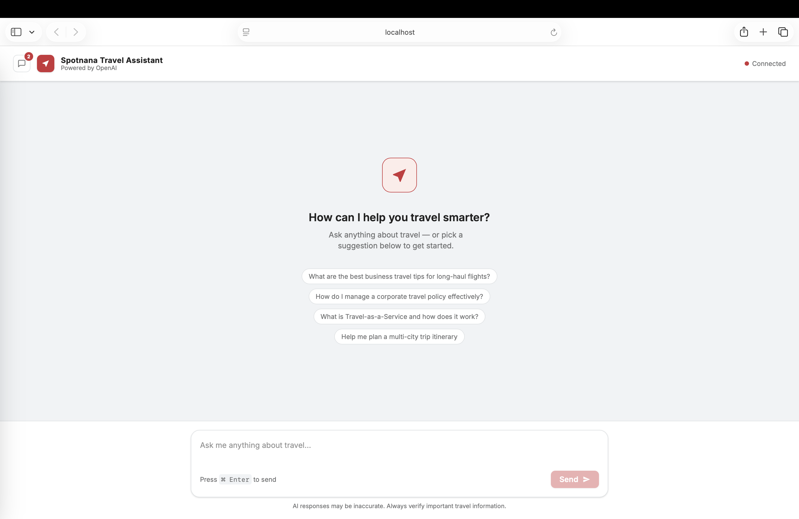
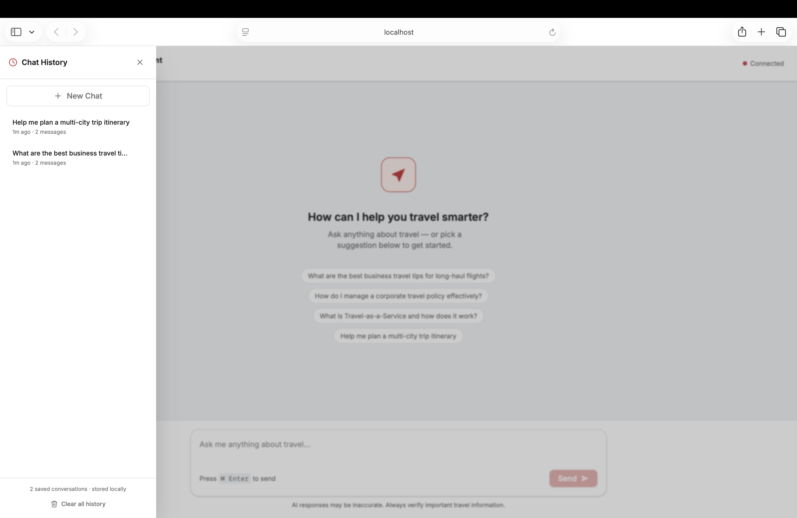

# Spotnana Travel Assistant

A lightweight AI chat interface built with React and Vite. Users can ask travel-related questions and receive answers from OpenAI's GPT API, displayed in a real-time chat UI styled to match Spotnana's brand.





---

## Features

- Prompt input with auto-resizing textarea
- Keyboard shortcut: Cmd/Ctrl + Enter to submit
- OpenAI GPT-4o-mini integration
- Animated typing indicator while the AI is responding
- Chat history — all prompts and responses in a scrollable thread, **persisted to localStorage** across page refreshes
- Persistent conversation sidebar — slide-over panel listing all saved conversations, with relative timestamps and message counts
- Load any previous conversation to resume where you left off
- Delete individual conversations, start a fresh chat, or clear all history at any time
- Error handling for invalid API keys, rate limits, and network failures
- Loading states on the submit button and message thread

---

## Getting Started

### Prerequisites

- Node.js v18 or higher
- An OpenAI API key: https://platform.openai.com/api-keys

### 1. Clone the repository

```bash
git clone https://github.com/sahana-n-h/ai-prompt-app.git
cd ai-prompt-app
```

### 2. Install dependencies

```bash
npm install
```

### 3. Configure your API key

Copy the example environment file:

```bash
cp .env.example .env
```

Open `.env` and add your key:

```env
OPENAI_API_KEY=sk-...your-key-here...
```

> `.env` is listed in `.gitignore` by default.

### 4. Start the development server

```bash
npm run dev
```

Open http://localhost:5173 in your browser.

---

## Project Structure

```
src/
├── components/
│   ├── Header.jsx
│   ├── PromptInput.jsx
│   ├── ChatHistory.jsx
│   ├── ChatMessage.jsx
│   ├── TypingIndicator.jsx
│   ├── EmptyState.jsx
│   └── ConversationHistoryPanel.jsx
├── hooks/
│   └── useConversations.js
├── services/
│   └── openai.js
├── App.jsx
├── main.jsx
└── index.css
```

---

## Tech Stack

| Tool | Purpose |
|---|---|
| React 19 | UI framework |
| Vite 6 | Build tool and dev server |
| Tailwind CSS v4 | Styling |
| Axios | HTTP client for OpenAI API calls |
| OpenAI API | AI model (gpt-4o-mini) |

---

## Build for Production

```bash
npm run build
```

Preview the output with:

```bash
npm run preview
```

---

## Environment Variables

| Variable | Required | Description |
|---|---|---|
| `OPENAI_API_KEY` | Yes | Your OpenAI secret API key |

---

## License

MIT
